# ZeroTier Overlay VPN Architecture

## How ZeroTier Creates Secure Connections Between Machines


## Connection Flow Explanation

### 1. **Initial Setup & Authentication**
- Each machine (A, B, C) installs ZeroTier client
- Machines join network using Network ID: `8056c2e21c000001`
- ZeroTier Controller authenticates and authorizes each device
- Each machine receives a virtual IP address in the `10.0.0.0/24` range

### 2. **Overlay Network Creation**
- ZeroTier creates a **software-defined network layer** above the physical internet
- This overlay abstracts away the complexity of:
  - NAT traversal
  - Firewall configurations  
  - Dynamic IP addresses
  - Different ISP networks

### 3. **Direct Peer-to-Peer Communication**
- **Primary Goal**: Direct encrypted tunnels between machines
- ZeroTier attempts to establish direct P2P connections when possible
- Uses UDP hole punching and other NAT traversal techniques
- Falls back to relay servers when direct connection impossible

### 4. **Traffic Flow Process**
1. **Machine A** wants to communicate with **Machine B**
2. Application uses virtual IP `10.0.0.2` to reach Machine B
3. ZeroTier client intercepts traffic destined for virtual network
4. Traffic is encrypted and encapsulated
5. Sent through established tunnel (direct P2P or via relay)
6. Machine B's ZeroTier client decrypts and delivers to application

### 5. **Key Benefits**
- **Seamless Connectivity**: Machines appear to be on same local network
- **Security**: All traffic encrypted end-to-end
- **Firewall Traversal**: Works behind NAT/firewalls without configuration
- **Location Independence**: Machines can move between networks seamlessly
- **Zero Configuration**: No manual VPN setup required

### 6. **ZeroTier Components**
- **Controller**: Manages network membership, authentication, and configuration
- **Root Servers (Planet)**: Help with initial peer discovery and NAT traversal
- **Client Software**: Creates virtual network interface on each machine

---

# Simplified Version for High School Students

## How Three Computers Talk to Each Other Using ZeroTier

```mermaid
graph TB
    subgraph "Step 1: Each Computer Joins the Same Virtual Club"
        A[Computer A<br/>📱 Alice Laptop]
        B[Computer B<br/>🖥️ Bob Desktop] 
        C[Computer C<br/>💻 Carol Phone]
        
        ZT[🌐 ZeroTier<br/>The Magic Connector]
        
        A -.->|Hey I want to join!| ZT
        B -.->|Me too!| ZT
        C -.->|Same here!| ZT
    end

    subgraph "Step 2: ZeroTier Creates Secret Tunnels"
        A2[Alice Laptop<br/>🏠 Home WiFi]
        B2[Bob Desktop<br/>🏢 School Network]
        C2[Carol Phone<br/>📶 Mobile Data]
        ZTRelay[ZeroTier Relay<br/>🌐 Only if needed]
        
        A2 -.->|🔒 DIRECT Tunnel<br/>Best case| B2
        A2 -.->|🔒 DIRECT Tunnel<br/>Best case| C2  
        B2 -.->|🔒 DIRECT Tunnel<br/>Best case| C2
        
        A2 -.->|🔒 Via Relay<br/>If direct fails| ZTRelay
        ZTRelay -.->|🔒 Via Relay<br/>If direct fails| B2
        
        style A2 fill:#ffeb3b,stroke:#f57f17,stroke-width:2px
        style B2 fill:#4caf50,stroke:#2e7d32,stroke-width:2px  
        style C2 fill:#2196f3,stroke:#0d47a1,stroke-width:2px
        style ZTRelay fill:#ff9800,stroke:#e65100,stroke-width:2px
    end

    subgraph "Step 3: They Can Now Share Files & Chat"
        Share[💬 Hey guys check out this file!<br/>📁 Sending homework.pdf<br/>🎮 Playing online games together]
        
        style Share fill:#e1f5fe,stroke:#01579b,stroke-width:3px
    end
```



## Simple Explanation: What's Actually Happening?

### ⚡ **IMPORTANT: How the Tunnels Actually Work**

ZeroTier tries to connect machines in **TWO WAYS**:

1. **🎯 DIRECT Connection (Best Case)**
   - Alice's laptop talks **DIRECTLY** to Bob's desktop
   - No ZeroTier servers involved in the actual conversation
   - Fastest and most efficient
   - Works about 80% of the time

2. **🌐 RELAY Connection (Backup Plan)**
   - If direct connection fails (strict firewalls, etc.)
   - Traffic goes: Alice → ZeroTier Relay Server → Bob
   - Still encrypted end-to-end
   - Slightly slower but still secure

**Think of it like this**: ZeroTier is like a matchmaker who introduces two people, then steps aside to let them talk directly. If they can't hear each other directly, the matchmaker helps relay messages.

### 🤔 **The Problem**
- Alice is at home, Bob is at school, Carol is using mobile data
- They all want to share files and chat like they're in the same room
- But they're on completely different internet networks!

### ✨ **The ZeroTier Solution**
1. **Join the Club**: All three install ZeroTier and join the same "virtual network" (like joining the same WhatsApp group)

2. **Get Magic Addresses**: Each computer gets a special "virtual address" that works anywhere:
   - Alice's laptop: `10.0.0.1` 
   - Bob's desktop: `10.0.0.2`
   - Carol's phone: `10.0.0.3`

3. **Create Secret Tunnels**: ZeroTier automatically creates encrypted "tunnels" between all computers

4. **Talk Directly**: Now they can share files, chat, or play games as if they're all connected to the same WiFi!

### 🔐 **Why It's Safe**
- All messages are **encrypted** (like writing in secret code)
- Only people in your virtual network can see the messages
- Works even if your school or home has strict firewalls

### 🎯 **Real-World Example**
Think of ZeroTier like a **group video call**:
- You all "dial in" to the same virtual room
- You can share screens, files, and chat
- It doesn't matter if you're on WiFi, mobile data, or different countries
- Everything is private to your group

**The magic**: ZeroTier makes distant computers act like they're plugged into the same router! 🪄

---

# General Overlay VPN Concept

## Simple Overlay VPN Communication Between Three Machines

```mermaid
graph TB
    subgraph "Physical Network (Underlay)"
        Internet[🌐 Internet]
        ISP1[ISP A]
        ISP2[ISP B]
        ISP3[ISP C]
        
        ISP1 --- Internet
        ISP2 --- Internet
        ISP3 --- Internet
    end

    subgraph "Machine Locations"
        MachineA[Machine A<br/>🖥️ Location A<br/>Physical: 203.0.113.10]
        MachineB[Machine B<br/>💻 Location B<br/>Physical: 198.51.100.5]
        MachineC[Machine C<br/>📱 Location C<br/>Physical: 192.0.2.15]
        
        MachineA --- ISP1
        MachineB --- ISP2
        MachineC --- ISP3
    end

    subgraph "Overlay VPN Network (Virtual Layer)"
        VPN[Virtual Network<br/>10.0.0.0/24]
        
        VPN -.->|Virtual IP: 10.0.0.1| MachineA
        VPN -.->|Virtual IP: 10.0.0.2| MachineB
        VPN -.->|Virtual IP: 10.0.0.3| MachineC
        
        style VPN fill:#e3f2fd,stroke:#1976d2,stroke-width:3px
    end

    subgraph "Encrypted Tunnels"
        MachineA -.->|🔒 Encrypted Tunnel| MachineB
        MachineA -.->|🔒 Encrypted Tunnel| MachineC
        MachineB -.->|🔒 Encrypted Tunnel| MachineC
    end

    classDef machine fill:#f9f9f9,stroke:#333,stroke-width:2px
    classDef network fill:#4caf50,stroke:#2e7d32,stroke-width:2px
    classDef infrastructure fill:#9e9e9e,stroke:#424242,stroke-width:2px

    class MachineA,MachineB,MachineC machine
    class ISP1,ISP2,ISP3,Internet infrastructure
```



## How Overlay VPN Works (General Concept)

### 🎯 **The Basic Idea**
An overlay VPN creates a **virtual network layer** on top of the existing internet infrastructure.

### 📋 **Step-by-Step Process**

1. **Physical Setup**
   - Each machine has a real IP address from their local network
   - Machine A: `203.0.113.10` (Corporate network)
   - Machine B: `198.51.100.5` (Home network)  
   - Machine C: `192.0.2.15` (Mobile network)

2. **Virtual Network Creation**
   - VPN software creates a virtual network: `10.0.0.0/24`
   - Each machine gets a virtual IP address:
     - Machine A: `10.0.0.1`
     - Machine B: `10.0.0.2`
     - Machine C: `10.0.0.3`

3. **Encrypted Tunnels**
   - Software creates encrypted tunnels between machines
   - Traffic appears to flow directly between virtual IPs
   - Actually travels through encrypted tunnels over the internet

### 🔍 **What Makes It "Overlay"**
- **Underlay**: Physical internet infrastructure (routers, ISPs, cables)
- **Overlay**: Virtual network built on top using software
- Like drawing roads on a map - the terrain (underlay) stays the same, but you create new paths (overlay)

### 💡 **Key Benefits**
- **Location Independence**: Machines appear to be on same network regardless of physical location
- **Security**: All communication is encrypted
- **Simplicity**: Applications see simple virtual IPs instead of complex routing
- **Flexibility**: Easy to add/remove machines from the virtual network

---

## What Do Overlay VPN Servers Actually Do?

The servers hosting overlay VPN networks have **two main jobs**:

### 🎛️ **Control Plane (The Management Side)**
These servers act like **network administrators**:

1. **Authentication & Authorization**
   - "Is Machine A allowed to join this network?"
   - "What permissions does Machine B have?"
   - Check credentials and certificates

2. **Network Configuration**
   - Assign virtual IP addresses (`10.0.0.1`, `10.0.0.2`, etc.)
   - Define network policies and rules
   - Manage routing tables

3. **Peer Discovery** 
   - "Machine A wants to talk to Machine B - here's how to find it"
   - Share connection information between machines
   - Coordinate initial handshakes

4. **Key Distribution**
   - Distribute encryption keys securely
   - Manage certificate authorities
   - Handle key rotation and updates

### 🚛 **Data Plane (The Traffic Side)**
Sometimes servers also handle actual traffic:

1. **NAT Traversal Help**
   - Assist machines behind firewalls to connect
   - Provide STUN/TURN services for hole punching
   - Help establish direct peer connections

2. **Relay Services (Backup)**
   - When direct connection fails: Machine A → Server → Machine B
   - Act as intermediary for encrypted traffic
   - Maintain connection when P2P isn't possible

3. **Load Balancing**
   - Distribute traffic across multiple paths
   - Optimize routing for performance
   - Handle failover scenarios

### 🎯 **Simple Analogy**
Think of overlay VPN servers like **airport control towers**:

- **Control Tower (Control Plane)**: 
  - "Flight 123, you're cleared to land on runway 2"
  - "Here's your gate assignment and flight plan"
  - Coordinates everything but doesn't carry passengers

- **Ground Services (Data Plane)**:
  - Sometimes helps guide planes when visibility is poor
  - Provides backup communication when direct radio fails
  - Only handles traffic when absolutely necessary

**Key Point**: Good overlay VPN servers try to **get out of the way** once machines can talk directly to each other!

---

# Software Defined Networking (SDN)

## SDN Architecture Overview

```mermaid
graph TB
    subgraph "Application Layer"
        App1[Network Apps<br/>🔥 Firewall Rules]
        App2[Load Balancer<br/>⚖️ Traffic Distribution] 
        App3[Monitoring<br/>📊 Network Analytics]
    end

    subgraph "Control Plane (Centralized Brain)"
        Controller[SDN Controller<br/>🧠 OpenDaylight/ONOS<br/>- Global network view<br/>- Policy decisions<br/>- Route calculations]
    end

    subgraph "Southbound API"
        OpenFlow[OpenFlow Protocol<br/>📡 Communication channel]
    end

    subgraph "Data Plane (Network Hardware)"
        Switch1[SDN Switch 1<br/>📦 Packet forwarding<br/>Flow table: 50 rules]
        Switch2[SDN Switch 2<br/>📦 Packet forwarding<br/>Flow table: 75 rules]
        Switch3[SDN Switch 3<br/>📦 Packet forwarding<br/>Flow table: 30 rules]
        Router1[SDN Router<br/>🌐 Inter-network routing]
    end

    subgraph "Physical Devices"
        ServerA[Server A<br/>💻 192.168.1.10]
        ServerB[Server B<br/>💻 192.168.1.20]
        ClientC[Client C<br/>📱 192.168.2.5]
        ClientD[Client D<br/>🖥️ 192.168.2.10]
    end

    %% Application to Controller
    App1 -.->|REST API| Controller
    App2 -.->|REST API| Controller  
    App3 -.->|REST API| Controller

    %% Controller to Switches
    Controller ==>|Flow rules<br/>via OpenFlow| Switch1
    Controller ==>|Flow rules<br/>via OpenFlow| Switch2
    Controller ==>|Flow rules<br/>via OpenFlow| Switch3
    Controller ==>|Flow rules<br/>via OpenFlow| Router1

    %% Data connections
    ServerA --- Switch1
    ServerB --- Switch1
    Switch1 --- Switch2
    Switch2 --- Switch3
    Switch2 --- Router1
    ClientC --- Switch3
    ClientD --- Switch3

    %% Packet flow example
    ServerA -.->|1. Packet arrives| Switch1
    Switch1 -.->|2. No rule? Ask controller| Controller
    Controller -.->|3. Install flow rule| Switch1
    Switch1 -.->|4. Forward packet| Switch2

    classDef app fill:#e1f5fe,stroke:#01579b,stroke-width:2px
    classDef controller fill:#ff6b35,stroke:#fff,stroke-width:3px,color:#fff
    classDef switch fill:#4caf50,stroke:#2e7d32,stroke-width:2px,color:#fff
    classDef device fill:#f9f9f9,stroke:#333,stroke-width:2px

    class App1,App2,App3 app
    class Controller controller
    class Switch1,Switch2,Switch3,Router1 switch
    class ServerA,ServerB,ClientC,ClientD device
```



## How SDN Works

### 🧠 **Core Concept: Centralized Control**
SDN separates the **control plane** (decision making) from the **data plane** (packet forwarding):

- **Traditional Network**: Each switch makes independent decisions
- **SDN Network**: Central controller makes all routing decisions

### 📋 **SDN Components**

#### 1. **SDN Controller (The Brain)**
- **Centralized intelligence** for the entire network
- Maintains **global network topology view**
- Makes routing and policy decisions
- Popular controllers: OpenDaylight, ONOS, Floodlight

#### 2. **OpenFlow Protocol**
- **Communication standard** between controller and switches
- Allows controller to **install flow rules** on switches
- Enables **real-time network programming**

#### 3. **SDN Switches (Dumb Forwarders)**
- **Flow tables** store forwarding rules from controller  
- **Match-action** processing: if packet matches rule, take action
- Contact controller when **no matching flow rule** exists

#### 4. **Network Applications**
- **Firewall**: Security policy enforcement
- **Load Balancer**: Traffic distribution across servers
- **Monitoring**: Real-time network analytics

### 🔄 **Packet Processing Flow**

1. **Packet Arrives**: Server A sends packet to Client C
2. **Table Lookup**: Switch checks flow table for matching rule
3. **Controller Query**: If no rule exists, switch asks controller
4. **Rule Installation**: Controller calculates path, installs flow rules
5. **Packet Forwarding**: Switch forwards packet according to new rule
6. **Future Packets**: Subsequent packets use installed rule (fast path)

### 🆚 **Traditional vs SDN Networking**

| Aspect | **Traditional Network** | **SDN Network** |
|--------|------------------------|------------------|
| **Control** | Distributed (each device) | Centralized (controller) |
| **Intelligence** | In network devices | In controller software |
| **Configuration** | Device-by-device | Programmatic/centralized |
| **Flexibility** | Limited, vendor-specific | High, software-defined |
| **Visibility** | Per-device view | Global network view |
| **Innovation** | Hardware refresh cycles | Software development cycles |

### 💡 **SDN Benefits**

#### **Network Programmability**
- **Automate configurations** across entire network
- **Dynamic policy changes** without manual intervention
- **Custom applications** for specific network needs

#### **Centralized Management**
- **Single point of control** for network policies
- **Consistent configurations** across all devices
- **Simplified troubleshooting** with global view

#### **Innovation Speed**
- **Software-based features** deploy faster than hardware
- **Vendor-agnostic** approach reduces lock-in
- **Rapid prototyping** of new network services

### 🎯 **Real-World Use Cases**

#### **Data Center Networking**
- **Multi-tenant isolation**: Separate traffic for different customers
- **Load balancing**: Dynamically distribute traffic across servers
- **Auto-scaling**: Adjust network paths as services scale

#### **Campus Networks**
- **Access control**: Dynamic user authentication and authorization
- **VLAN management**: Automated network segmentation
- **Quality of Service**: Prioritize critical applications

#### **Service Provider Networks**
- **Network slicing**: Create virtual networks for different services
- **Traffic engineering**: Optimize paths based on real-time conditions
- **Service chaining**: Route traffic through security appliances

### 🔧 **SDN Implementation Example**

```python
# Simplified SDN Controller Logic
def handle_packet_in(packet, switch_id):
    # Analyze incoming packet
    src_ip = packet.src_ip
    dst_ip = packet.dst_ip
    
    # Calculate optimal path
    path = calculate_shortest_path(src_ip, dst_ip)
    
    # Install flow rules on switches in path
    for switch in path:
        flow_rule = {
            'match': {'src_ip': src_ip, 'dst_ip': dst_ip},
            'action': {'forward_port': get_next_hop_port(switch, path)}
        }
        install_flow_rule(switch, flow_rule)
    
    # Forward original packet
    forward_packet(packet, path[0])
```

SDN transforms networking from **hardware-centric** to **software-centric**, enabling unprecedented flexibility and control over network behavior.

---

# Underlay VPN (Traditional VPN Services)

## What SurfShark, NordVPN, ExpressVPN Do

Traditional VPN providers like **SurfShark** operate fundamentally differently from overlay VPNs. They focus on **privacy, security, and location masking**.

```mermaid
graph TB
    subgraph "Your Location"
        You[👤 Your Device<br/>192.168.1.100<br/>Real IP: 203.0.113.50]
        Router[🏠 Home Router<br/>NAT Gateway]
        
        You --- Router
    end

    subgraph "ISP Network"
        ISP[🌐 Your ISP<br/>Can see everything<br/>without VPN]
        
        Router --- ISP
    end

    subgraph "VPN Provider Infrastructure"
        VPNServer1[🛡️ SurfShark Server<br/>📍 Netherlands<br/>IP: 185.123.45.67]
        VPNServer2[🛡️ SurfShark Server<br/>📍 United States<br/>IP: 199.87.123.45]
        VPNServer3[🛡️ SurfShark Server<br/>📍 Japan<br/>IP: 202.98.76.54]
    end

    subgraph "Target Websites"
        Netflix[🎬 Netflix<br/>Thinks you're in Netherlands]
        Google[🔍 Google<br/>Sees VPN server IP]
        Bank[🏦 Your Bank<br/>Sees Netherlands IP]
    end

    %% Without VPN (blocked/visible)
    ISP -.->|❌ ISP can see<br/>all your traffic| Netflix
    ISP -.->|❌ Your real location<br/>exposed| Google

    %% With VPN (encrypted tunnel)
    You ==>|🔒 Encrypted Tunnel<br/>ALL traffic goes here| VPNServer1
    VPNServer1 -->|Appears to come<br/>from Netherlands| Netflix
    VPNServer1 -->|Your real IP<br/>is hidden| Google
    VPNServer1 -->|Location<br/>appears as Netherlands| Bank

    %% Server choices
    You -.->|Can choose| VPNServer2
    You -.->|Can choose| VPNServer3

    classDef user fill:#ffeb3b,stroke:#f57f17,stroke-width:2px
    classDef vpn fill:#4caf50,stroke:#2e7d32,stroke-width:3px
    classDef target fill:#e3f2fd,stroke:#1976d2,stroke-width:2px
    classDef infrastructure fill:#9e9e9e,stroke:#424242,stroke-width:2px

    class You user
    class VPNServer1,VPNServer2,VPNServer3 vpn
    class Netflix,Google,Bank target
    class ISP,Router infrastructure
```



## How Underlay VPN Works

### 🎯 **Primary Purpose**
Traditional VPN services focus on:
- **Privacy**: Hide your real IP address and location
- **Security**: Encrypt all internet traffic  
- **Access**: Bypass geo-restrictions and censorship

### 📋 **How It Works**

1. **Encrypted Tunnel Creation**
   - Your device creates an encrypted tunnel to VPN server
   - **ALL** your internet traffic goes through this tunnel
   - Your ISP only sees encrypted data going to VPN server

2. **IP Address Masking**
   - Websites see the VPN server's IP, not yours
   - Your real location is completely hidden
   - You appear to be browsing from VPN server location

3. **Traffic Routing**
   - You → Encrypted Tunnel → VPN Server → Target Website
   - Website → VPN Server → Encrypted Tunnel → You
   - VPN server acts as your "internet representative"

### 🔍 **What VPN Providers Do**

#### **SurfShark's Infrastructure**
- **Global Server Network**: 3,200+ servers in 100+ countries
- **Server Management**: Maintain, secure, and optimize servers
- **Traffic Routing**: Route all user traffic through their infrastructure
- **IP Pool Management**: Provide shared IP addresses for anonymity

#### **Key Services Provided**

1. **Traffic Encryption**
   - AES-256 encryption for all data
   - Secure tunneling protocols (WireGuard, OpenVPN, IKEv2)
   - DNS leak protection

2. **Location Spoofing** 
   - Choose exit server location
   - Bypass geo-blocks (Netflix regions, etc.)
   - Access censored content

3. **Privacy Protection**
   - No-logs policies
   - Hide browsing from ISP
   - Prevent tracking by websites/advertisers

4. **Security Features**
   - Kill switch (disconnect if VPN fails)
   - Multi-hop routing (extra security)
   - Malware/ad blocking

### 🆚 **Underlay vs Overlay VPN**

| Aspect | **Underlay VPN** (SurfShark) | **Overlay VPN** (ZeroTier) |
|--------|------------------------------|----------------------------|
| **Purpose** | Privacy, security, anonymity | Connect specific devices |
| **Traffic** | ALL internet traffic | Only between network members |
| **Location** | Hide/change location | Doesn't matter |
| **Use Case** | Browse privately, bypass geo-blocks | Remote access, file sharing |
| **Connection** | You ↔ VPN Server ↔ Internet | Device ↔ Device (direct) |

### 🎯 **Real-World Examples**

**SurfShark Use Cases:**
- **Streaming**: Access US Netflix from Europe
- **Privacy**: Hide browsing from government/ISP
- **Security**: Safe browsing on public WiFi
- **Business**: Secure remote work connections

**How SurfShark Makes Money:**
- Monthly/yearly subscriptions ($2-12/month)
- Shared infrastructure costs across millions of users
- Economies of scale for server maintenance