# Underlay VPN (Traditional VPN Services)

## What SurfShark, NordVPN, ExpressVPN Do

Traditional VPN providers like **SurfShark**, **NordVPN**, and **ExpressVPN** operate as centralized privacy and security services. They focus on **privacy, security, and location masking** for individual users.

```mermaid
graph TB
    subgraph "Your Location"
        You[👤 Your Device<br/>192.168.1.100<br/>Real IP: 203.0.113.50]
        Router[🏠 Home Router<br/>NAT Gateway]
        
        You --- Router
    end

    subgraph "ISP Network"
        ISP[🌐 Your ISP<br/>Can see everything<br/>without VPN]
        
        Router --- ISP
    end

    subgraph "VPN Provider Infrastructure"
        VPNServer1[🛡️ SurfShark Server<br/>📍 Netherlands<br/>IP: 185.123.45.67]
        VPNServer2[🛡️ SurfShark Server<br/>📍 United States<br/>IP: 199.87.123.45]
        VPNServer3[🛡️ SurfShark Server<br/>📍 Japan<br/>IP: 202.98.76.54]
    end

    subgraph "Target Websites"
        Netflix[🎬 Netflix<br/>Thinks you're in Netherlands]
        Google[🔍 Google<br/>Sees VPN server IP]
        Bank[🏦 Your Bank<br/>Sees Netherlands IP]
    end

    %% Without VPN (blocked/visible)
    ISP -.->|❌ ISP can see<br/>all your traffic| Netflix
    ISP -.->|❌ Your real location<br/>exposed| Google

    %% With VPN (encrypted tunnel)
    You ==>|🔒 Encrypted Tunnel<br/>ALL traffic goes here| VPNServer1
    VPNServer1 -->|Appears to come<br/>from Netherlands| Netflix
    VPNServer1 -->|Your real IP<br/>is hidden| Google
    VPNServer1 -->|Location<br/>appears as Netherlands| Bank

    %% Server choices
    You -.->|Can choose| VPNServer2
    You -.->|Can choose| VPNServer3

    classDef user fill:#ffeb3b,stroke:#f57f17,stroke-width:2px
    classDef vpn fill:#4caf50,stroke:#2e7d32,stroke-width:3px
    classDef target fill:#e3f2fd,stroke:#1976d2,stroke-width:2px
    classDef infrastructure fill:#9e9e9e,stroke:#424242,stroke-width:2px

    class You user
    class VPNServer1,VPNServer2,VPNServer3 vpn
    class Netflix,Google,Bank target
    class ISP,Router infrastructure
```

## How Underlay VPN Works

### 🎯 **Primary Purpose**
Traditional VPN services focus on:
- **Privacy**: Hide your real IP address and location
- **Security**: Encrypt all internet traffic  
- **Access**: Bypass geo-restrictions and censorship
- **Anonymity**: Prevent tracking by ISPs, governments, and websites

### 📋 **Traffic Flow Process**

1. **Without VPN**
   - You → ISP → Target Website
   - ISP can see all your browsing activity
   - Websites see your real IP and location
   - Government/ISP can monitor and log traffic

2. **With VPN**
   - You → Encrypted Tunnel → VPN Server → Target Website
   - ISP only sees encrypted data to VPN server
   - Websites see VPN server IP, not yours
   - Your real location and identity are hidden

### 🔍 **What VPN Providers Actually Do**

#### **Infrastructure Management**
- **Global Server Network**: Thousands of servers worldwide
  - SurfShark: 3,200+ servers in 100+ countries
  - NordVPN: 5,400+ servers in 60+ countries
  - ExpressVPN: 3,000+ servers in 94+ countries

- **Server Operations**
  - Maintain physical and virtual servers
  - Ensure high-speed connections
  - Manage server load balancing
  - Handle security updates and patches

#### **Core Services Provided**

### 1. **Traffic Encryption & Tunneling**
- **AES-256 encryption** for all data transmission
- **Secure protocols**: WireGuard, OpenVPN, IKEv2/IPSec
- **DNS leak protection** to prevent identity exposure
- **Kill switch** functionality (disconnects if VPN fails)

### 2. **IP Address Masking & Location Spoofing**
- Hide your real IP address from websites
- Provide shared IP addresses for anonymity
- Allow selection of exit server location
- Dynamic IP rotation for enhanced privacy

### 3. **Geo-Restriction Bypass**
- Access region-locked content (Netflix US, BBC iPlayer, etc.)
- Circumvent internet censorship in restrictive countries
- Bypass workplace/school network restrictions
- Access blocked social media platforms

### 4. **Privacy Protection**
- **No-logs policies** (don't store user activity data)
- **Anonymous payment options** (cryptocurrency, cash)
- **RAM-only servers** (data wiped on restart)
- **Independent security audits** to verify claims

## VPN Provider Business Models

### 🏢 **How They Make Money**

#### **Subscription-Based Revenue**
- **Monthly plans**: $8-15/month
- **Annual plans**: $2-8/month (significant discounts)
- **Multi-year plans**: $1-4/month (best value)

#### **Operational Costs**
- **Server infrastructure**: Rent/own thousands of servers globally
- **Bandwidth costs**: Handle massive amounts of user traffic
- **Staff**: Engineers, customer support, security experts
- **Legal compliance**: Different laws in each country
- **Marketing**: Heavy advertising and affiliate programs

### 📊 **Scale Economics**
- Millions of users share server infrastructure costs
- Bulk bandwidth purchases reduce per-user costs
- Automated systems minimize manual management
- Geographic diversity spreads regulatory risks

## Real-World Use Cases

### 🎬 **Streaming & Entertainment**
- **Access geo-locked content**: Watch US Netflix from Europe
- **Bypass throttling**: ISPs can't slow down specific services
- **Sports streaming**: Access matches blocked in your region
- **Gaming**: Reduce ping, bypass game restrictions

### 🔒 **Privacy & Security**
- **Public WiFi protection**: Encrypt traffic on untrusted networks
- **ISP surveillance**: Hide browsing from internet providers
- **Government monitoring**: Bypass state surveillance programs
- **Corporate espionage**: Protect business communications

### 🌍 **Censorship Circumvention**
- **Social media access**: Use Facebook, Twitter in restricted countries
- **News access**: Read independent journalism in censored regions
- **Communication tools**: Access WhatsApp, Telegram, Signal
- **Academic research**: Access blocked educational resources

### 💼 **Business Applications**
- **Remote work security**: Secure connections to company resources
- **Multi-location access**: Appear to browse from different countries
- **Competitive research**: Hide business intelligence activities
- **Price comparison**: Avoid dynamic pricing based on location

## Technical Implementation

### 🔧 **VPN Protocols Explained**

#### **WireGuard** (Modern, Fast)
- Newest protocol with minimal code base
- Excellent performance and battery life
- Strong cryptography with simpler implementation
- Preferred by modern VPN providers

#### **OpenVPN** (Reliable, Flexible)
- Open-source protocol with extensive features
- Highly configurable and widely supported
- Good balance of security and compatibility
- Works well in restrictive network environments

#### **IKEv2/IPSec** (Mobile-Optimized)
- Excellent for mobile devices
- Fast reconnection when switching networks
- Built into most operating systems
- Good for frequently changing connections

### 🛡️ **Security Features**

#### **Encryption Standards**
- **AES-256**: Military-grade encryption standard
- **ChaCha20**: Alternative cipher for mobile devices
- **RSA-4096**: Secure key exchange
- **SHA-512**: Cryptographic hash function

#### **Advanced Protection**
- **Perfect Forward Secrecy**: New keys for each session
- **DNS leak protection**: Prevent DNS queries from exposing identity
- **IPv6 leak protection**: Block IPv6 traffic that might reveal identity
- **WebRTC leak protection**: Prevent browser-based IP leaks

## Comparison with Other Technologies

### 🆚 **Underlay VPN vs Overlay VPN**

| Aspect | **Underlay VPN** (SurfShark) | **Overlay VPN** (ZeroTier) |
|--------|------------------------------|----------------------------|
| **Purpose** | Privacy, security, anonymity | Connect specific devices |
| **Traffic Scope** | ALL internet traffic | Only between network members |
| **Location Impact** | Hide/change apparent location | Location doesn't matter |
| **Primary Use** | Browse privately, bypass geo-blocks | Remote access, file sharing |
| **Connection Model** | You ↔ VPN Server ↔ Internet | Device ↔ Device (P2P) |
| **Cost Model** | Monthly subscription per user | Often free for small networks |
| **Setup Complexity** | Simple app installation | Network configuration required |
| **Performance** | Slight latency increase | Often faster (direct connections) |

### 🔄 **Underlay VPN vs Proxy Services**

| Feature | **VPN** | **Proxy** |
|---------|---------|-----------|
| **Encryption** | Yes, full traffic encryption | No, just forwarding |
| **Application Support** | All applications | Browser/specific apps only |
| **Security Level** | High | Basic |
| **Speed** | Moderate overhead | Minimal overhead |
| **Privacy** | Strong | Limited |

## Limitations and Considerations

### ⚠️ **Potential Drawbacks**

#### **Performance Impact**
- **Speed reduction**: 10-50% slower than direct connection
- **Latency increase**: Additional hop adds delay
- **Bandwidth limits**: Some providers throttle heavy users
- **Server congestion**: Popular servers may be slower

#### **Legal and Regulatory**
- **Blocked by services**: Netflix actively blocks many VPN IPs
- **Country restrictions**: VPNs illegal in some jurisdictions
- **Terms of service**: May violate website ToS
- **Data retention laws**: VPN providers subject to local laws

#### **Trust Requirements**
- **Provider honesty**: Must trust no-logs claims
- **Security breaches**: VPN servers can be compromised
- **Government pressure**: Providers may be forced to cooperate
- **Business changes**: Company acquisitions may change policies

### 🎯 **Choosing the Right VPN**

#### **Key Evaluation Criteria**
1. **No-logs policy** with independent audits
2. **Strong encryption** and modern protocols
3. **Server locations** in desired countries
4. **Connection speed** and reliability
5. **Customer support** quality
6. **Price and payment options**
7. **Device compatibility** and simultaneous connections

#### **Red Flags to Avoid**
- Free VPN services (often sell user data)
- Providers based in surveillance alliance countries
- No independent security audits
- Vague privacy policies
- Poor customer reviews for speed/reliability

## Future of Underlay VPNs

### 🚀 **Emerging Trends**

#### **Technology Evolution**
- **WireGuard adoption**: Faster, more efficient protocols
- **Zero-knowledge architectures**: Enhanced privacy guarantees
- **Decentralized VPNs**: Peer-to-peer VPN networks
- **AI-powered optimization**: Smart server selection and routing

#### **Regulatory Landscape**
- **Privacy legislation**: GDPR, CCPA increasing privacy awareness
- **Censorship expansion**: More countries restricting internet access
- **VPN blocking**: Increased efforts to detect and block VPN traffic
- **Legal challenges**: Ongoing battles over VPN legality

The underlay VPN market continues evolving as privacy concerns grow and internet restrictions increase globally. Traditional VPN providers adapt by improving technology, expanding server networks, and enhancing security features to stay ahead of blocking efforts and meet growing user demands for digital privacy.
