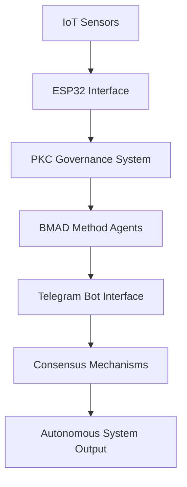

# GitHub Team Repository Setup Guide

## **Overview**
Simple guide for setting up GitHub accounts and team repositories for the hackathon.

## **GitHub Account Requirements**
- All students must have a GitHub account
- Use school email address for education benefits
- Set up SSH keys for secure access
- Configure Git with proper username and email

## **Team Repository Requirements**
- Repository name: `hackathon-2025-[teamname]`
- Must be public for collaboration and showcase
- All team members must have write access
- Must include README with team information
- All projects must use BMAD Method

## **Basic Setup Steps**

### **GitHub Account Setup**
1. Create GitHub account at github.com
2. Use school email for education benefits
3. Set up SSH keys for secure access
4. Configure Git with username and email

### **Team Repository Setup**
1. Team Technical Lead creates repository
2. Repository name: `hackathon-2025-[teamname]`
3. Set repository to public
4. Add all team members as collaborators
5. Create basic README file

### **Repository Structure**
Teams should organize their repository with:
- README.md with team information
- docs/ folder for documentation
- src/ folder for source code
- BMAD Method integration files
- Session progress documentation

### **BMAD Method Integration**
All team repositories must include:
- BMAD Method configuration files
- Story Master, Developer, and QA agent setup
- Workflow documentation
- Progress tracking using BMAD patterns
mkdir -p tests/{unit,integration,governance}
mkdir -p assets/{images,documents,presentations}

# Create GovTech structure (matching PKC)
mkdir -p GovTech/{PKC,MCard_TDD,THKMesh}
mkdir -p GovTech/PKC/{policies,personas,cultural_constraints}
mkdir -p GovTech/MCard_TDD/{stories,development,testing}
mkdir -p GovTech/THKMesh/{consensus,validation,governance}
```

### **Step 2: Initial Repository Files (15 minutes)**

#### **Enhanced README.md**
```markdown
# PKC Sovereign Network - Team [Name]

## Meta-Narrative Framework Implementation
Autonomous PKC-IoT integration using Conversational Programming and BMAD Method for BBS AI Hackathon 2025.

## Team Members
- **Narrative Architect**: [Name] (@github-username) - Story structure and Meta-Narrative flow
- **Technical Lead**: [Name] (@github-username) - PKC integration and IoT implementation  
- **Conversational Programmer**: [Name] (@github-username) - Monadic thinking and typed arrows
- **Consensus Coordinator**: [Name] (@github-username) - Team governance and validation
- **Cultural Integrator**: [Name] (@github-username) - Cultural sensitivity and knowledge integration

## Project Vision
[Team's mission statement from Session 1]

## Architecture Overview


## Technology Stack
- **PKC**: Personal Knowledge Container for governance
- **BMAD Method**: Agentic workflow orchestration
- **ESP32**: IoT device integration
- **Telegram Bot**: Conversational interface
- **Google APIs**: Cloud services and AI integration
- **Docker**: Containerized deployment

## Getting Started
See [Setup Guide](docs/setup.md) for detailed installation instructions.

## Documentation
- [Session Notes](docs/sessions/) - Daily learning and progress
- [Governance Framework](docs/governance/) - Team decision-making processes
- [Meta-Narratives](docs/narratives/) - Story development and cultural integration

## License
MIT License - See [LICENSE](LICENSE) for details.
```

#### **Team Governance File**
Create `docs/governance/TEAM_CHARTER.md`:
```markdown
# Team Charter - [Team Name]

## Governance Model
**Decision Making**: Consensus-based using Meta-Narrative Framework validation
**Conflict Resolution**: Narrative mediation through Conversational Programming
**Cultural Sensitivity**: Mandatory review for all contributions

## Communication Protocol
- **Daily Standups**: 15 minutes each morning
- **Consensus Meetings**: As needed for major decisions
- **Code Reviews**: Required for all commits
- **Cultural Reviews**: Required for narrative content

## Roles & Responsibilities
### Narrative Architect
- Design story structure and Meta-Narrative flow
- Ensure cultural integration in all narratives
- Lead consensus processes for story validation

### Technical Lead  
- Oversee PKC integration and IoT implementation
- Manage technical architecture decisions
- Coordinate with other teams on technical standards

### Conversational Programmer
- Implement monadic thinking patterns in code
- Design typed arrows for all AI interactions
- Lead peer-to-peer teaching sessions

### Consensus Coordinator
- Facilitate team governance processes
- Manage validation and consensus mechanisms
- Coordinate with trainers and other teams

### Cultural Integrator
- Ensure cultural sensitivity in all work
- Lead cultural knowledge integration
- Review all content for inclusive representation

## Contribution Guidelines
1. All code must follow Conversational Programming patterns
2. All narratives must pass cultural sensitivity review
3. All major decisions require team consensus
4. All commits must include rationale and cultural impact assessment

## Consensus Mechanism
- **Proposal**: Any team member can propose changes
- **Discussion**: Open dialogue using Conversational Programming
- **Cultural Review**: Assessment of cultural impact
- **Technical Review**: Evaluation of technical feasibility
- **Consensus Vote**: 75% agreement required for approval
- **Implementation**: Assigned to appropriate team member
- **Validation**: Post-implementation review and adjustment
```

### **Step 3: Development Workflow Setup (10 minutes)**

#### **Branch Protection Rules**
1. Go to repository Settings > Branches
2. Click "Add rule"
3. Branch name pattern: `main`
4. Enable:
   - Require pull request reviews before merging
   - Require status checks to pass
   - Require branches to be up to date
   - Include administrators

#### **Issue Templates**
Create `.github/ISSUE_TEMPLATE/`:

**Feature Request Template** (`.github/ISSUE_TEMPLATE/feature_request.md`):
```markdown
---
name: Feature Request
about: Propose new functionality using Meta-Narrative Framework
title: '[FEATURE] '
labels: enhancement, meta-narrative
assignees: ''
---

## Meta-Narrative Context
**Story Element**: Which part of our narrative does this enhance?
**Cultural Impact**: How does this affect cultural integration?

## Conversational Programming Structure
**Input (a)**: What inputs does this feature require?
**Monadic Context (M)**: What context/state management is needed?
**Output (b)**: What outputs/effects will this produce?

## Consensus Requirements
- [ ] Technical feasibility reviewed
- [ ] Cultural sensitivity assessed
- [ ] Team consensus achieved
- [ ] Implementation plan approved

## Acceptance Criteria
- [ ] Feature implements Conversational Programming patterns
- [ ] Cultural integration requirements met
- [ ] Consensus mechanism validation passed
- [ ] Documentation updated
```

**Bug Report Template** (`.github/ISSUE_TEMPLATE/bug_report.md`):
```markdown
---
name: Bug Report
about: Report issues in our autonomous system
title: '[BUG] '
labels: bug, needs-consensus
assignees: ''
---

## Error Context
**System Component**: PKC / IoT / BMAD / Telegram / Other
**Monadic Pattern**: Which pattern failed? Reader/State/Writer/Either?

## Expected Behavior (Success Case)
Describe the expected autonomous system behavior.

## Actual Behavior (Failure Case)
Describe what actually happened.

## Cultural Impact Assessment
Does this bug affect cultural integration or sensitivity?

## Reproduction Steps
1. 
2. 
3. 

## Consensus for Fix
- [ ] Bug impact assessed
- [ ] Cultural implications reviewed
- [ ] Fix approach agreed upon
- [ ] Implementation assigned
```

---

## **Part 3: Team Collaboration Workflow**

### **Step 1: Team Member Invitation (10 minutes)**

#### **Add Team Members**
1. Repository owner goes to Settings > Manage access
2. Click "Invite a collaborator"
3. Add each team member's GitHub username
4. Set permission level: **Write** (allows push to branches)
5. Team members accept invitations via email

#### **Team Organization (Optional)**
1. Create GitHub Organization: `bbs-hackathon-2025-[school]`
2. Transfer repository to organization
3. Create teams within organization:
   - `team-[name]-core` (all team members)
   - `team-[name]-reviewers` (consensus coordinators)
   - `trainers` (hackathon trainers)

### **Step 2: Development Workflow (15 minutes)**

#### **Feature Development Process**
```bash
# 1. Create feature branch
git checkout main
git pull origin main
git checkout -b feature/narrative-iot-integration

# 2. Implement feature using Conversational Programming
# Follow monadic patterns and cultural integration

# 3. Commit with detailed messages
git add .
git commit -m "feat: implement IoT-narrative bridge with cultural validation

- Add ESP32 conversational interface using typed arrows
- Implement Reader/State/Writer pattern for sensor data
- Include cultural sensitivity checks for data interpretation
- Add consensus mechanism for sensor validation

Cultural Impact: Ensures IoT data respects cultural context
Technical Pattern: Monadic composition with explicit error handling
Consensus: Approved by team in daily standup 2025-10-09"

# 4. Push and create pull request
git push origin feature/narrative-iot-integration
```

#### **Pull Request Template**
Create `.github/pull_request_template.md`:
```markdown
## Meta-Narrative Framework Integration

### Story Context
**Narrative Element**: Which story component does this implement?
**Cultural Integration**: How does this respect cultural diversity?

### Conversational Programming Patterns
- [ ] Uses typed arrows (`a -> M b`) structure
- [ ] Implements explicit context management (Reader/State/Writer)
- [ ] Includes graceful error handling (Either/Validation)
- [ ] Follows monadic composition principles

### Consensus Validation
- [ ] Technical review completed
- [ ] Cultural sensitivity assessed
- [ ] Team consensus achieved (75%+ agreement)
- [ ] Integration tests passing

### BMAD Method Integration
- [ ] Compatible with Story Master agent
- [ ] Supports Developer agent workflow
- [ ] Includes QA agent validation hooks
- [ ] Enables agentic orchestration

### Checklist
- [ ] Code follows team conventions
- [ ] Documentation updated
- [ ] Tests added/updated
- [ ] Cultural impact assessed
- [ ] Consensus mechanism validated
```

### **Step 3: Integration with PKC and BMAD (20 minutes)**

#### **Repository Integration with PKC**
Create `config/pkc_integration.yaml`:
```yaml
pkc_integration:
  repository:
    url: "https://github.com/username/pkc-sovereign-network-teamname"
    branch: "main"
    sync_enabled: true
    
  governance:
    consensus_file: "docs/governance/TEAM_CHARTER.md"
    decision_log: "docs/governance/decisions.md"
    cultural_guidelines: "docs/governance/cultural_integration.md"
    
  meta_narrative:
    stories_directory: "docs/narratives/"
    cultural_context: "docs/narratives/cultural_context.md"
    validation_rules: "docs/narratives/validation_rules.md"
    
  bmad_integration:
    stories_sync: true
    agent_configs: "config/bmad/"
    workflow_definitions: "src/bmad/workflows/"
```

#### **GitHub Actions for Automation**
Create `.github/workflows/meta-narrative-validation.yml`:
```yaml
name: Meta-Narrative Framework Validation

on:
  pull_request:
    branches: [ main ]
  push:
    branches: [ main ]

jobs:
  conversational-programming-check:
    runs-on: ubuntu-latest
    steps:
    - uses: actions/checkout@v3
    
    - name: Validate Monadic Patterns
      run: |
        # Check for proper typed arrow structure
        grep -r "a -> M b" src/ || echo "Warning: No typed arrows found"
        
    - name: Cultural Sensitivity Check
      run: |
        # Run cultural sensitivity validation
        python scripts/cultural_validation.py
        
    - name: Consensus Mechanism Test
      run: |
        # Validate consensus mechanisms
        python scripts/consensus_validation.py
        
  pkc-integration-test:
    runs-on: ubuntu-latest
    steps:
    - uses: actions/checkout@v3
    
    - name: Test PKC Integration
      run: |
        docker-compose -f docker-compose.test.yml up --abort-on-container-exit
        
  bmad-compatibility:
    runs-on: ubuntu-latest
    steps:
    - uses: actions/checkout@v3
    
    - name: BMAD Method Compatibility Check
      run: |
        npx bmad-method validate --config config/bmad/
```

---

## **Part 4: Documentation and Knowledge Management**

### **Step 1: Session Documentation Structure (10 minutes)**

#### **Daily Session Notes**
Create template `docs/sessions/session_template.md`:
```markdown
# Session [Number]: [Title] - [Date]

## Learning Objectives Achieved
- [ ] Objective 1
- [ ] Objective 2
- [ ] Objective 3

## Conversational Programming Progress
### Monadic Thinking Development
- **Reader Pattern**: [What we learned about context management]
- **State Pattern**: [How we handled state transitions]
- **Writer Pattern**: [What effects and logging we implemented]

### Typed Arrow Implementation
```
Input -> Monadic Context -> Output
[Specific examples from today's work]
```

## Cultural Integration Insights
- **Cultural Sensitivity Learnings**: 
- **Inclusive Design Decisions**:
- **Cross-Cultural Collaboration**:

## Technical Achievements
- **PKC Integration**: 
- **IoT Development**:
- **BMAD Method Progress**:
- **API Integrations**:

## Team Consensus Decisions
| Decision | Rationale | Cultural Impact | Consensus % |
|----------|-----------|-----------------|-------------|
| [Decision 1] | [Why] | [Impact] | [%] |

## Challenges and Solutions
### Technical Challenges
- **Challenge**: 
- **Solution**: 
- **Learning**: 

### Cultural/Communication Challenges
- **Challenge**: 
- **Solution**: 
- **Learning**: 

## Tomorrow's Preparation
- [ ] Task 1
- [ ] Task 2
- [ ] Task 3

## Reflection Questions
1. How did we apply Conversational Programming today?
2. What cultural insights did we gain?
3. How effective was our consensus mechanism?
4. What would we do differently?
```

### **Step 2: Knowledge Base Integration (15 minutes)**

#### **Wiki Setup**
1. Enable GitHub Wiki for repository
2. Create main pages:
   - **Home**: Project overview and navigation
   - **Meta-Narrative Framework**: Detailed explanation
   - **Conversational Programming Guide**: Team reference
   - **Cultural Integration Handbook**: Sensitivity guidelines
   - **Technical Architecture**: System design documentation
   - **Consensus Mechanisms**: Decision-making processes

#### **Documentation Automation**
Create `scripts/update_docs.py`:
```python
#!/usr/bin/env python3
"""
Automated documentation updater for Meta-Narrative Framework
Syncs repository documentation with PKC and generates reports
"""

import os
import yaml
import json
from datetime import datetime

def update_session_progress():
    """Update session progress tracking"""
    sessions = []
    for session_file in os.listdir('docs/sessions/'):
        if session_file.endswith('.md'):
            # Parse session completion status
            # Update progress tracking
            pass
    
def validate_cultural_integration():
    """Validate cultural integration across all content"""
    # Check for inclusive language
    # Verify cultural sensitivity guidelines followed
    # Generate cultural impact report
    pass

def sync_with_pkc():
    """Sync documentation with PKC instance"""
    # Upload session notes to PKC
    # Update governance documents
    # Sync consensus decisions
    pass

if __name__ == "__main__":
    update_session_progress()
    validate_cultural_integration()
    sync_with_pkc()
    print("Documentation updated successfully!")
```

---

## **Part 5: Assessment and Validation**

### **Repository Quality Checklist**

#### **Technical Standards**
- [ ] Repository follows naming convention
- [ ] README.md is comprehensive and up-to-date
- [ ] Directory structure matches Meta-Narrative Framework
- [ ] All team members have appropriate access
- [ ] Branch protection rules configured
- [ ] Issue and PR templates created
- [ ] GitHub Actions workflows functional

#### **Meta-Narrative Integration**
- [ ] Team charter reflects Conversational Programming principles
- [ ] Governance documents include consensus mechanisms
- [ ] Cultural integration guidelines established
- [ ] Session documentation structure implemented
- [ ] PKC integration configuration complete

#### **Collaboration Effectiveness**
- [ ] All team members actively contributing
- [ ] Pull requests include proper cultural assessment
- [ ] Consensus mechanism being used for decisions
- [ ] Regular commits with meaningful messages
- [ ] Documentation kept current

### **Success Metrics**

#### **Quantitative Measures**
- **Commit Frequency**: Daily commits from all team members
- **PR Review Time**: < 24 hours average
- **Consensus Achievement**: 75%+ agreement on decisions
- **Documentation Coverage**: All sessions documented
- **Cultural Validation**: 100% of content reviewed

#### **Qualitative Assessment**
- **Conversational Programming Adoption**: Evidence of monadic thinking
- **Cultural Sensitivity**: Inclusive and respectful content
- **Team Collaboration**: Effective consensus and communication
- **Technical Integration**: Successful PKC and BMAD integration
- **Innovation**: Creative application of Meta-Narrative Framework

## **Expected Outcomes**

By completing this GitHub setup, teams will have:
1. **Professional repositories** with proper structure and documentation
2. **Collaborative workflows** supporting Conversational Programming
3. **Cultural integration** processes embedded in development
4. **Consensus mechanisms** for team decision-making
5. **PKC and BMAD integration** for autonomous system development
6. **Automated validation** of Meta-Narrative Framework compliance
7. **Knowledge management** system for continuous learning
8. **Foundation** for showcase and portfolio development

## **Integration with Hackathon Sessions**

This GitHub setup directly supports:
- **Session 1**: Team formation and governance charter
- **Session 2**: PKC integration and BMAD Method setup
- **Sessions 3-6**: Development workflow and collaboration
- **Sessions 7-10**: Project implementation and documentation
- **Sessions 11-12**: Showcase preparation and portfolio presentation
